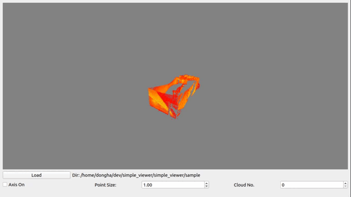

# Simple Point Cloud Viewer using QT & OpenGL

## Requirements 
### ([Important!] not sure since I haven't tested it in an empty computer)
OpenGL

PCL

Qt

```
sudo apt-get install libopengl-dev libpcl-dev qt5-default
```

## How to run

```
cd {Package Directory}
mkdir build && cd build
cmake -DCMAKE_BUILD_TYPE=Release ..
cmake --build .
cd ..
./build/simple_viewer
```

Or you can simplely launch this in vscode (see launch.json)

I also included some sample point clouds in the /sample folder. Try to load these point clouds.


